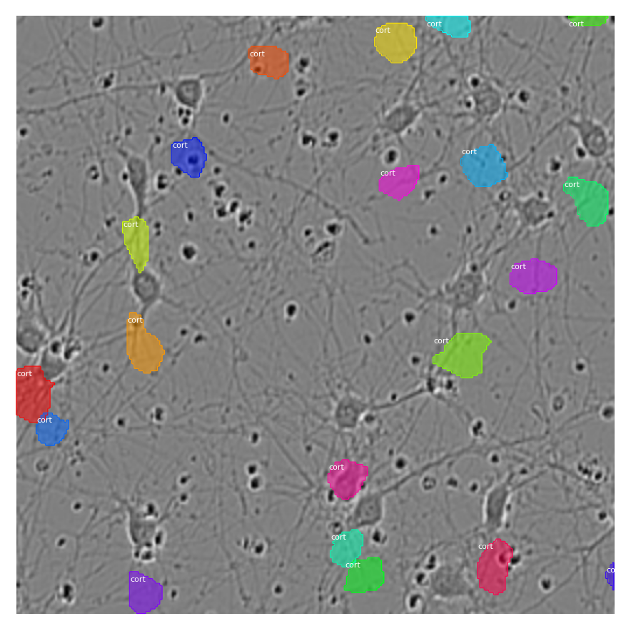
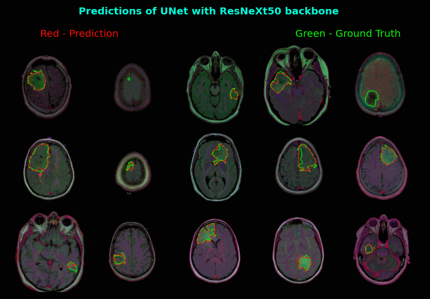
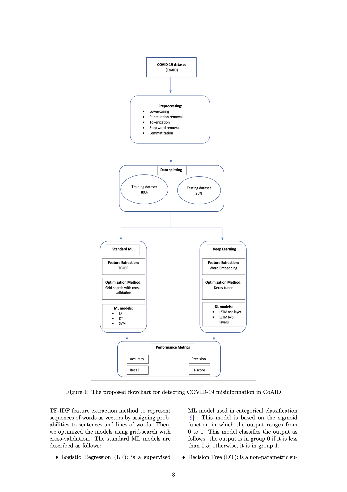

## Portfolio

---

### Data Science

[Sartorius-cell instance segmentation using Mask R-CNN](https://medium.com/mlearning-ai/cell-instance-segmentation-using-mask-r-cnn-c7a3810192ff)

---
[Brain tumor segmentation](https://devpost.com/software/brain-tumor-segmentation-using-resunet)

---
[COVID-19 Misinformation detection using deep learning](https://github.com/nghi-huynh/covid-19-misinfo-detection)

---

### Entrepreneur Idea

- [Project 1 Title](http://example.com/)
- [Project 2 Title](http://example.com/)
- [Project 3 Title](http://example.com/)
- [Project 4 Title](http://example.com/)
- [Project 5 Title](http://example.com/)

---

---

Page template forked from <a href="https://github.com/evanca/quick-portfolio">evanca</a>

<!-- Remove above link if you don't want to attibute -->
