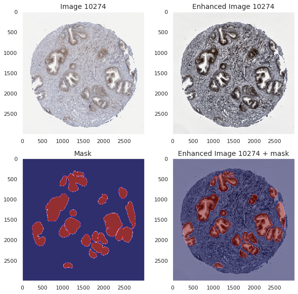
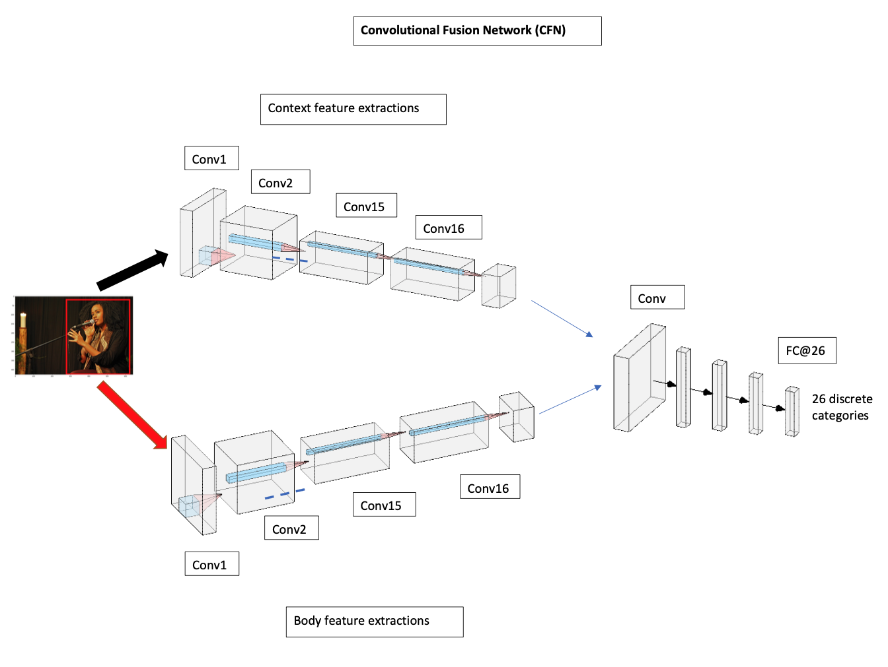

## About Me

Hello, I'm Nghi. I'm a McGill graduate with a major in Computer Science and Biology and a minor in Mathematics. I'm interested in data science, especially the applications of deep learning in the healthcare domain.

My areas of interest:

* Computer Vision
* Machine Learning
* NLP
* Data Analytics

---

## My Latest Projects

[Kaggle Competition: EDA HuBMAP + HPA - Hacking the Human Body](https://www.kaggle.com/code/nghihuynh/hubmap-hpa-exploratory-data-analysis)

---

[KYMN-Mental Health Chatbot Powered by AI](https://github.com/nghi-huynh/mental_health_chatbot)

---

[Time Trends and Predictions of Mental Health and Suicide Rates based on Socioeconomic Indicators](https://github.com/nghi-huynh/BigDataChallenge2022)

---

## Publications

    2022

[Time trends and predictions of mental health and suicide rates based on so- cioeconomic indicators from 2000 to 2019](https://journal.stemfellowship.org/doi/pdf/10.17975/sfj-2022-010)

Nghi Huynh, Yuan Hong

--- 

    2021

[CoAID: Detecting Misleading Information Using Deep Learning Models](https://journal.stemfellowship.org/doi/pdf/10.17975/sfj-2021-003)

Nghi Huynh

---

Page template forked from <a href="https://github.com/evanca/quick-portfolio">evanca</a>

<!-- Remove above link if you don't want to attibute -->
