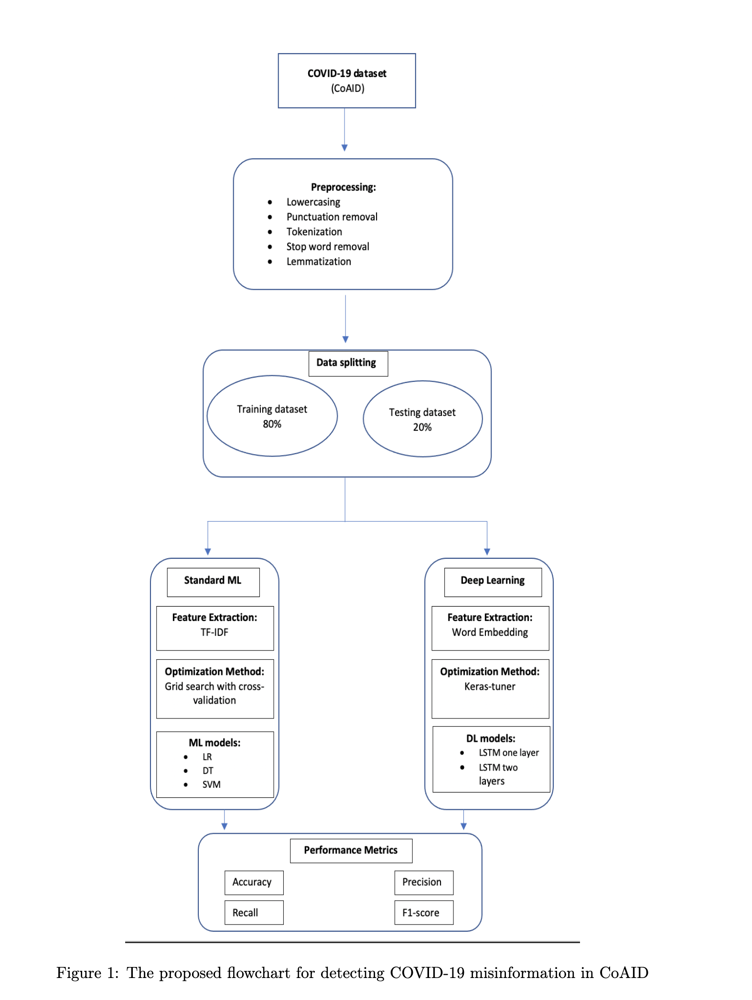

# Portfolio

---

### Machine Learning Projects

[KYMN-Mental Health Chatbot Powered by AI](https://github.com/nghi-huynh/mental_health_chatbot)

---

[Sartorius-cell instance segmentation using Mask R-CNN](https://medium.com/mlearning-ai/cell-instance-segmentation-using-mask-r-cnn-c7a3810192ff)

---
[Brain tumor segmentation](https://devpost.com/software/brain-tumor-segmentation-using-resunet)

---
[COVID-19 Misinformation detection using deep learning](https://github.com/nghi-huynh/covid-19-misinfo-detection)

### Data Science Projects

[Time Trends and Predictions of Mental Health and Suicide Rates based on Socioeconomic Indicators](https://github.com/nghi-huynh/BigDataChallenge2022)

---

[COVID-19 Misinformation detection using deep learning](https://github.com/nghi-huynh/covid-19-misinfo-detection)

# Blogs

---

### Machine Learning Stories

- [Neural Networks](https://medium.com/mlearning-ai/neural-networks-ba6fa76eb719)
- [Convolutional Neural Networks for Image Recognition ](https://medium.com/mlearning-ai/convolutional-neural-networks-for-image-recognition-7148a19f981f)
- [Vision beyond classification: Object detection](https://medium.com/mlearning-ai/vision-beyond-classification-task-i-object-detection-d2f32a5ea4ca)
- [Vision beyond classification: Image Segmentation](https://medium.com/mlearning-ai/vision-beyond-classification-tasks-beyond-classification-task-ii-image-segmentation-5c5e81edf2b0)

# Publications

    2022

[Time trends and predictions of mental health and suicide rates based on so- cioeconomic indicators from 2000 to 2019](https://journal.stemfellowship.org/doi/pdf/10.17975/sfj-2022-010)

Nghi Huynh, Yuan Hong

--- 

    2021

[CoAID: Detecting Misleading Information Using Deep Learning Models](https://journal.stemfellowship.org/doi/pdf/10.17975/sfj-2021-003)

Nghi Huynh

---

Page template forked from <a href="https://github.com/evanca/quick-portfolio">evanca</a>

<!-- Remove above link if you don't want to attibute -->
