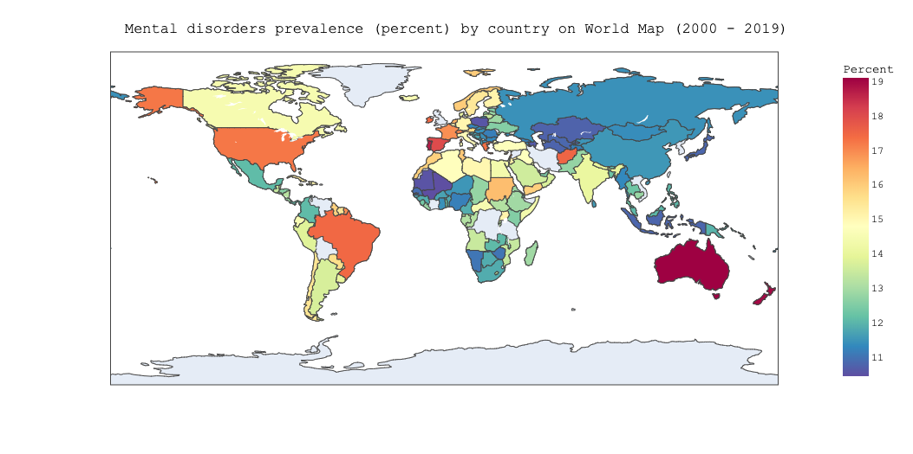

---

<h2 align="center">About Me</h2>

Hello, I'm Nghi. I'm a McGill graduate with a major in Computer Science and Biology and a minor in Mathematics. I'm interested in data science, especially the applications of deep learning in the healthcare domain.

**My areas of interest:**

* Computer Vision
* Machine Learning
* NLP
* Data Analytics

**Quick Link:** <a href="pdf/Nghi_Huynh_cv2022_np.pdf">Resume/CV</a>

---

<h2 align="center">My Latest Projects</h2>

[Kaggle Competition: EDA HuBMAP + HPA - Hacking the Human Body](https://www.kaggle.com/code/nghihuynh/hubmap-hpa-exploratory-data-analysis)

---

[KYMN-Mental Health Chatbot Powered by AI](https://github.com/nghi-huynh/mental_health_chatbot)

---

[Time Trends and Predictions of Mental Health and Suicide Rates based on Socioeconomic Indicators](https://github.com/nghi-huynh/BigDataChallenge2022)

---

<h2 align="center">Publications</h2>

    2022

[Time trends and predictions of mental health and suicide rates based on so- cioeconomic indicators from 2000 to 2019](https://journal.stemfellowship.org/doi/pdf/10.17975/sfj-2022-010)

Nghi Huynh, Yuan Hong

**Abstract:** Suicide poses a significant health problem worldwide. Most suicides are related to mental health disorders, a critical factor in national economies. Yet national health systems are frequently under-resourced and inefficient, resulting in an imbalance between health expenditures and mental illness burdens. Although suicide rates are highly correlated to mental disorders, there is no direct link between suicide rates and economic status. Thus, the objectives of this report are (1) to investigate the trends and correlations of socioeconomic factors on mental health and suicide rates across different income groups and (2) to project suicide rates and mental disease burdens up to 2030. Using data from the World Bank, Global Burden of Disease 2019, and World Health Organization database from 2000 to 2019, we presented and compared the trends and patterns of economic growth, suicide rates, and mental health for all income groups. Our analysis used DBA k-means clustering to estimate the associations among socioeconomic indicators, mental health illness, and suicide rates. We used the ARIMA model to provide predictions. Our findings reveal the influence of social factors such as unemployment rates on mental health and suicide rates worldwide. Besides, the projections for mental disorders burden during the next decade do not seem to be an encouraging trend except for high-income countries. Our results represent appropriate starting points for governments to adopt more comprehensive interventions and practical strategies to reduce suicide rates and eventually bridge the gap to the 2030 Sustainable Development Goals.

--- 

    2021

[CoAID: Detecting Misleading Information Using Deep Learning Models](https://journal.stemfellowship.org/doi/pdf/10.17975/sfj-2021-003)

Nghi Huynh

**Abstract:** COVID-19 virus has rapidly spread around the world and affected lots of peoples’ lives. Unfortunately, the diffusion of misinformation related to COVID-19 also gets created and propagates wildly on social media and other platforms. Since the spread of such misleading information has caused many adverse effects on public health, it is crucial to build computerized systems to understand, detect, and mitigate such misinformation. In this paper, we proposed a deep neural network for the detection of fake news. The deep learning models are the modified LSTM with one layer and the modified LSTM with two layers. In particular, we carried out our experiments with a large dataset from tweets and other platforms related to COVID- 19. We then separated the dubious claims and news articles into two categories: fake and real. In addition, we set up our baselines with three machine learning models: logistic regression (LR), decision tree (DT), and support vector machines (SVMs). We then validated and compared the performances of these baselines with our LSTM models. The results obtained from our proposed models reveal high accuracy (89%) in distinguishing fake tweets from real tweets in the COVID-19 dataset. These results also show a significant improvement in our proposed model as compared to the existing state of art results from the baseline machine learning models. Our findings demonstrate the efficacy and accurateness of the LSTM models in detecting COVID-19 related misinformation and offer a methodological contributions to misinformation detection.

---

Page template forked from <a href="https://github.com/evanca/quick-portfolio">evanca</a>

<!-- Remove above link if you don't want to attibute -->
