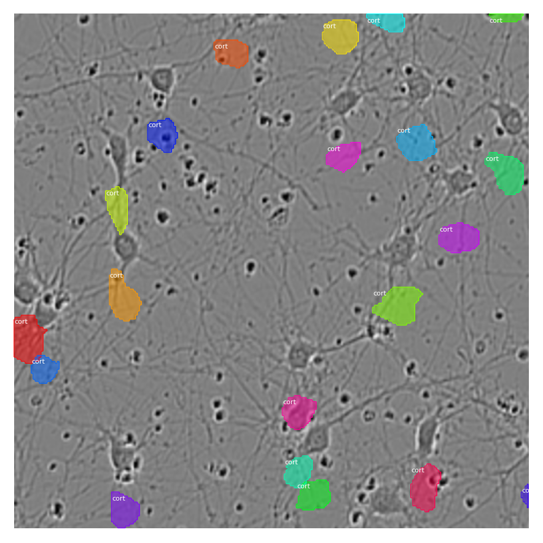

---

<h2 align="center">Machine Learning Projects</h2>

[KYMN-Mental Health Chatbot Powered by AI](https://github.com/nghi-huynh/mental_health_chatbot)

---

[Sartorius-cell instance segmentation using Mask R-CNN](https://medium.com/mlearning-ai/cell-instance-segmentation-using-mask-r-cnn-c7a3810192ff)

---
[Brain tumor segmentation](https://devpost.com/software/brain-tumor-segmentation-using-resunet)

---
[COVID-19 Misinformation detection using deep learning](https://github.com/nghi-huynh/covid-19-misinfo-detection)

---

<h2 align="center">Data Science Projects</h2>

[Time Trends and Predictions of Mental Health and Suicide Rates based on Socioeconomic Indicators](https://github.com/nghi-huynh/BigDataChallenge2022)

---

[COVID-19 Misinformation detection using deep learning](https://github.com/nghi-huynh/covid-19-misinfo-detection)

